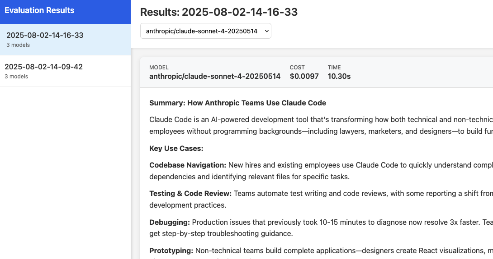

# quick-prompt-evals

A lightweight Python application for running quick evaluations of large language models (LLMs) against custom prompts. Provides:

- A CLI to run prompts across one or more models, tracking cost and latency
- A Flask-based web UI and REST API to browse, filter, and view past results
- Automatic JSON output files with timestamps and metadata


---

## Features

- **CLI-driven evaluations**
  • Supply prompts via command-line or file
  • Test multiple models in one run
  • Prints response, cost (USD) and latency per model
  • Saves outputs as `outputs/results-<timestamp>.json`

- **Web UI & API**
  • Browse result files in a sidebar
  • Inspect individual model runs (rendered Markdown)
  • API endpoints:
    - `GET /api/files` – list available result files
    - `GET /api/file/<filename>` – fetch a JSON result

- **Extensible**
  • Add new prompts under `prompts/`
  • Swap or add models via the `litellm` library

---

## Table of Contents

1. [Installation](#installation)
2. [Configuration](#configuration)
3. [Usage](#usage)
   - [CLI](#cli)
   - [Web UI](#web-ui)
4. [Project Structure](#project-structure)
5. [Contributing](#contributing)
6. [License](#license)

---

## Installation

### Prerequisites

- Python 3.13+
- [uv CLI tool](https://docs.astral.sh/uv/getting-started/installation/)
- Your LLM API key(s) (e.g. `OPENAI_API_KEY`)

### Steps

```bash
# Clone the repo
git clone git@github.com:ohnotnow/quick-prompt-evals.git
cd quick-prompt-evals

# Install Python dependencies
uv sync

# Create a .env file at project root with your API key(s):
# e.g.:
echo "OPENAI_API_KEY=your_openai_api_key_here" > .env
```

---

## Configuration

All environment variables (API keys, endpoints, etc.) are loaded via `python-dotenv`. Create a `.env` file with entries like:

```
OPENAI_API_KEY=sk-...
OTHER_PROVIDER_KEY=...
```

---

## Usage

### CLI

Run one or more models on a user prompt:

```bash
uv run main.py \
  --user-prompt "Translate 'Hello, world!' to French" \
  --system-prompt "You are a helpful translator." \
  --models openai/o4-mini,anthropic/claude-sonnet-4-20250514
```

Or supply your prompt from a file:

```bash
uv run main.py --user-prompt-file prompts/summarise.md
```

The CLI prints each model’s response, cost, and elapsed time, then writes a JSON file in `outputs/`.

### Web UI

Launch the Flask app:

```bash
uv run webui.py
```

Open your browser at [http://127.0.0.1:5000](http://127.0.0.1:5000).

- Click on a timestamp in the sidebar to load its results
- Select a model from the dropdown to view its response (rendered Markdown)
- API endpoints available at `/api/files` and `/api/file/<filename>`

---

## Project Structure

```
.
├── main.py              # CLI entry point: runs prompt evaluations
├── webui.py             # Flask app: browse and view results
├── templates/
│   └── index.html       # Jinja2 template for the dashboard
├── prompts/
│   └── summarise.md     # Example prompt file
├── outputs/             # Auto-generated JSON result files
├── pyproject.toml       # Project metadata & dependencies
└── uv.lock              # Locked dependency versions for uv
```

---

## Contributing

1. Fork the repository
2. Create a feature branch (`git checkout -b feature/name`)
3. Commit your changes and push (`git push origin feature/name`)
4. Open a Pull Request

Please include tests and update documentation as needed.

---

## License

This project is licensed under the MIT License. See [LICENSE](LICENSE) for details.
